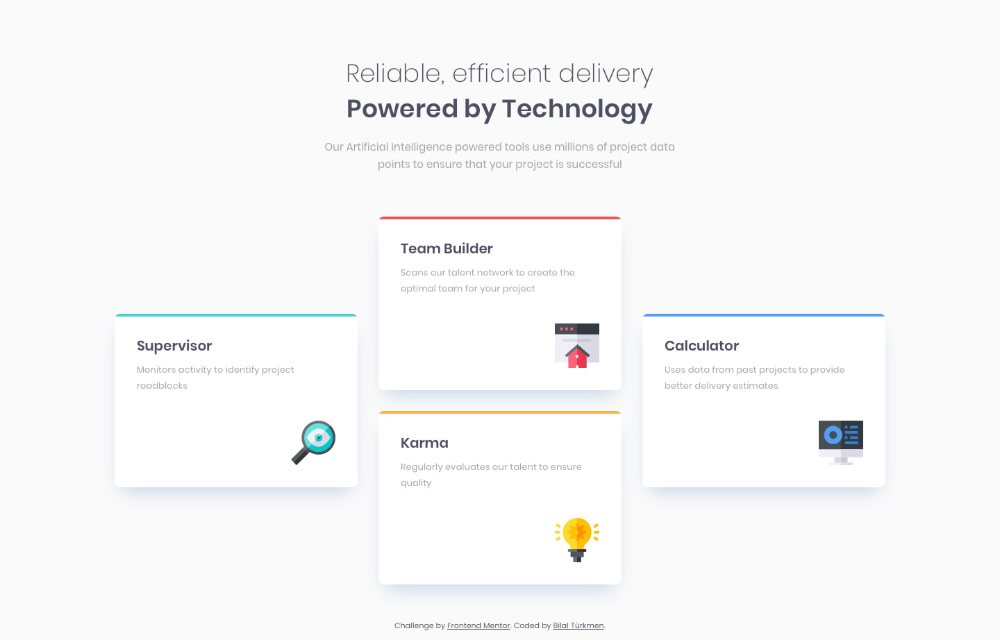

<h1>Four card feature section </h1>
  

    <h3>
      <a href="https://bilalturkmen.github.io/four-card-feature-section/"> Live View </a>
       | 
      <a href="https://www.frontendmentor.io/solutions/four-card-feature-section-challenge-with-css-grid-vdJDK27_nC"> Solution Page </a>
    </h3>

 

A challenge on Frontend Mentor.

### 👍 My Challenges:

- Training for `grid-area` property 😉
- Add dark mode with css
- Presenting pixel perfect view on my solution page
- See hover states for all interactive elements

### 🎉 Build With:

- Semantic HTML5 markup
- CSS Grid & Flexbox
- Mobile-first workflow
- CSS custom properties
