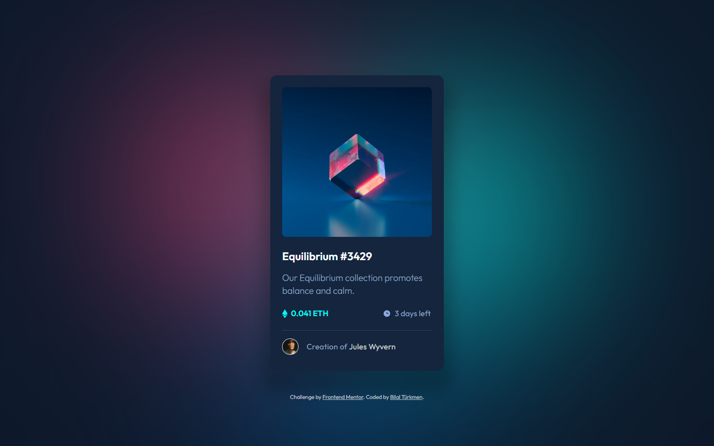

<h1>NFT preview card component</h1>

  <h3>
    <a href="https://bilalturkmen.github.io/nft-preview-card-component/"> Live View </a>
     | 
    <a href="https://frontendmentor.io/solutions/nft-preview-card-component-flexbox-nZkg6C_Bik"> Solution Page </a>
  </h3>

 A challenge on Frontend Mentor.

### 👍 My Challenges:

- i made a small touch to the background.
- And i added a nice click animation on nft image.
- Presenting pixel perfect view on my solution page
- See hover states for all interactive elements

### 🎉 Build With:

- Semantic HTML5 markup
- Flexbox
- Mobile-first workflow
- CSS custom properties
