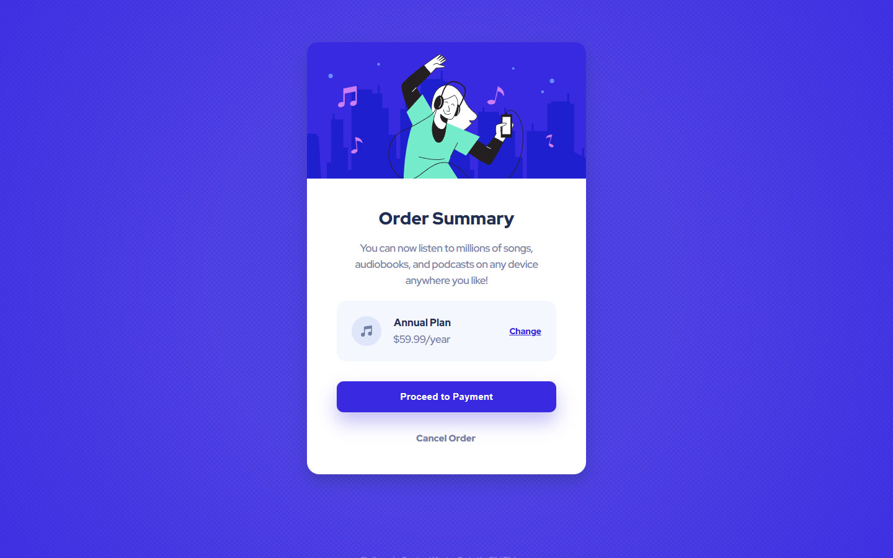

<h1 >Order summary card solution</h1>

  <h3>
    <a href="https://bilalturkmen.github.io/order-summary/"> Live View </a>
     | 
    <a href="https://www.frontendmentor.io/solutions/order-summary-card-with-flexbox-sDvU61gxez"> Solution Page </a>
  </h3>

  A challenge on Frontend Mentor.

### 👍 My Challenges:

- Hierarchically organize css properties to keep css codes in order.
- And also presenting a good page experience.
- See hover states for all interactive elements.

### 🎉 Build With:

- Semantic HTML5 markup
- Flexbox
- Mobile-first workflow
- CSS custom properties
