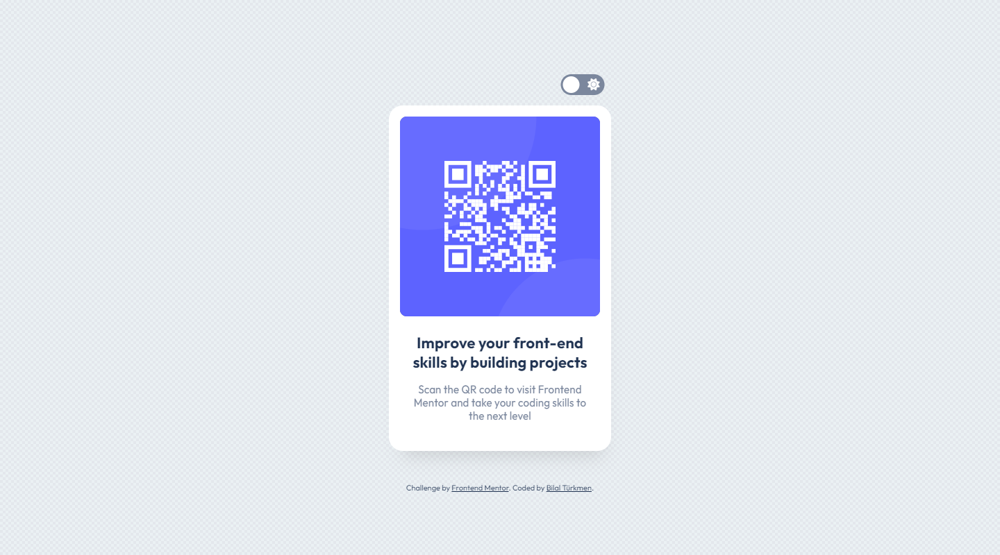

<h1>QR Code Component</h1>

  <h3>
    <a href="https://bilalturkmen.github.io/qr-code-component/"> Live View </a>
     | 
    <a href="https://www.frontendmentor.io/solutions/qr-code-component-with-flexbox-VatIn7QzgX"> Solution Page </a>
  </h3>

  Solution to the challenge on Frontend Mentor.

### 👍 My Challenges:

- made some color adjustments
- added toggle switch for dark mode
- Presenting pixel perfect view on my solution page
- See hover states for all interactive elements

### 🎉 Build With:

- Semantic HTML5 markup
- Flexbox
- Mobile-first workflow
- CSS custom properties
